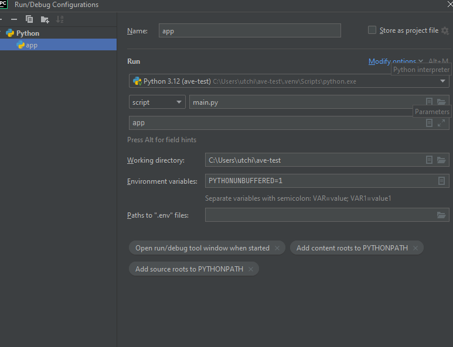
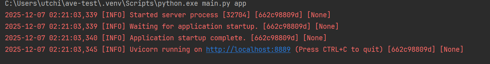

# 💜💜

# ave-test
## Тестовое задание AVE Technologies
___

## Цель задания
Разработать микросервис для хранения и управления связками "телефон-адрес". Такой сервис может использоваться для:
Кеширования часто запрашиваемой информации.
___

## Словарь терминов:  
Router/Рут - Вэб хэндлер, принимающий запрос. Логика минимальна Pydantic реквест/респонс модели 
и вызов сервиса.  

Services/Сервис - Класс описывающий исполнение основной логики запроса, 
отсюда идет вызов репозиториев/других сервисов/core

Repository/Репозиторий - Класс описывающий логику общения с базами(Postgresql/Redis)  
___
## Используемый стек: 
### FastAPI - веб-фреймворк, 
### Redis - как cache-store, 
### Python 3.12 
### Sqlalchemy 2.0.44 - ORM
### Orjson - сериализатор для json'а  

___

## Запуск приложения в Docker:
`make run-staging`
### В докере на 80 порту живет nginx, так что дока и API находятся по адресу http://localhost/api/public/docs

___

## Запуск приложения локально(инфра в dc)
### Я использую пакетный менеджер `uv`(см.дока https://docs.astral.sh/uv/getting-started/), после установки нужно поставить зависимости командой:
``uv sync --frozen --no-cache``
### Затем поднять инфру в dc
``make run-local``
### Накатить миграции
``make migration``
### Для запуска приложения используется точка входа `main.py` с параметром `app`
#### Можно настроить конфиг запуска в IDE(например, в PyCharm вот так выглядит)


### После чего приложение запуститься на  http://localhost:8889


### Дока и API доступна по адресу
http://localhost:8889/api/public/docs

### Для конфигурированием аппой используется модуль `core/config.py`, для Docker через переменные окружения `.env.example`(он тоже потом прокидывается в `core/config.py`) 

___

## Postmortens:
### 1) Для простоты я не стал реализовывать полноценную механику инвалидации кэша + сборка кэша для получения всех контактов, это довольно сложная и громоздкая механика + от этого больше вреда, чем пользы(битый или тухлый кэш на L7/CDN, оч вероятно заафектит юзеров, в таком случае придется сбрасывать вручную на уровне CDN)
#### Решение: Нужно добавить эффективную механику инвалидации/сборки/пересборки кэш-дерева(возможно фоново, через Celery или согласованный ttl)

___
## Достаупные API:
### POST /api/public/v1/contacts
### Description: Создать контакт(связка с телефон+адрес)
### Request Example
```json
    {
      "phone": "+71234567892",
      "address": "sdfsdfsd"
  }
```
### Response Example
```json
{
  "result": {
    "phone": "+71234567892",
    "address": "sdfsdfsd"
  },
  "status": 201,
  "error_message": ""
}
```
### Error Example
```json
{
  "result": {
    "field": "phone",
    "value": "+712345678912"
  },
  "status": 400,
  "error_message": "Invalid phone number format. Expected: +71234567890, 71234567890 or 81234567890"
}
```

```json
{
  "result": {
    "phone_already_exists": "+71234567890"
  },
  "status": 409,
  "error_message": "Duplicate data"
}
```
### GET api/public/v1/contacts
### Description: Получить все контакты
### Response Example
```json
{
  "result": [
    {
      "phone": "+71234567890",
      "address": "sdfsdfsd"
    },
    {
      "phone": "+71234567892",
      "address": "sdfsdfsd"
    }
  ],
  "status": 200,
  "error_message": ""
}
```
### GET api/public/v1/contacts/search?phone=71234567890
### Description: Получить контакт по phone, address или по обеим параметрам
### Query Params: phone or address
### Format Query Params: phone=71234567890 or +71234567890, address=Any
### Response Example
```json
{
  "result": {
    "phone": "+71234567890",
    "address": "sdfsdfsd"
  },
  "status": 200,
  "error_message": ""
}
```
### Error Example
```json
{
  "result": {
    "field": "phone",
    "value": "71234q567890"
  },
  "status": 400,
  "error_message": "Invalid phone number format. Expected: +71234567890, 71234567890 or 81234567890"
}
```
### PUT api/public/v1/contacts/update/<address_id>
### Description: Обновить контакты адреса/телефона по address_id
### Request Example
```json
{
  "phone": "71234567890",
  "address": "aboba"
}
```
### Response Example
```json
{
  "result": {
    "phone": "+71234567890",
    "address": "aboba"
  },
  "status": 200,
  "error_message": ""
}
```
### Error Example
```json
{
  "result": {
    "contact_id_not_found": 10
  },
  "status": 404,
  "error_message": "Not found data"
}
```
```json
{
  "result": {
    "field": "phone",
    "value": "711234567890"
  },
  "status": 400,
  "error_message": "Invalid phone number format. Expected: +71234567890, 71234567890 or 81234567890"
}
```

### DELETE api/public/v1/contacts/delete/71234567892
### Response example
```json
{
  "result": {
    "delete_contact_id": 4
  },
  "status": 204,
  "error_message": ""
}
```
### Error example
```json
{
  "result": {
    "field": "phone",
    "value": "712345678921"
  },
  "status": 400,
  "error_message": "Invalid phone number format. Expected: +71234567890, 71234567890 or 81234567890"
}
```